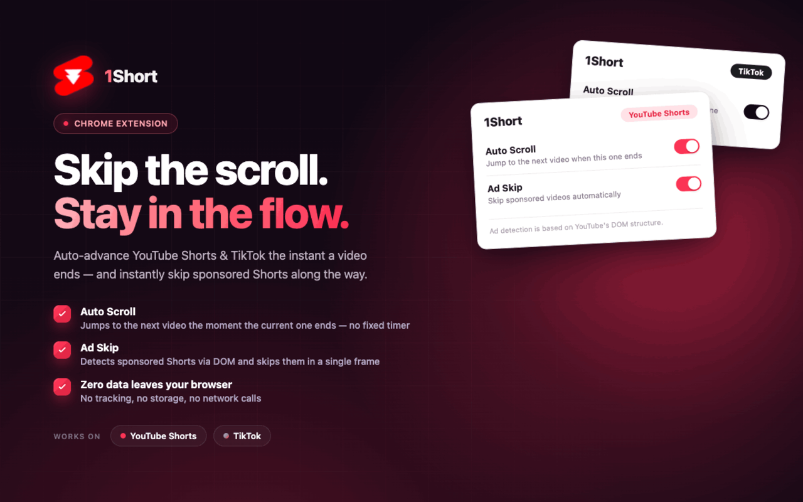

<div align="center">
  
  <h1>1Short</h1>
  <p>A Chrome extension that automatically scrolls through YouTube Shorts and TikTok videos.</p>
</div>

---

<div align="center">
 
</div>

### Features

- **Auto Scroll** — Automatically moves to the next video the moment the current one ends, with no fixed timer
- **Ad Skip** — Detects sponsored videos via DOM structure and skips them instantly

---

### Supported Platforms

| Platform | Auto Scroll | Ad Skip |
|----------|-------------|---------|
| YouTube Shorts | ✓ | ✓ |
| TikTok | ✓ | — |

---

### How It Works

**Auto Scroll**
Listens to the video's `timeupdate` event. When the playback position resets near the end (loop detection) or `ended` fires, it triggers navigation to the next video — no polling, no fixed interval.

---

### Permissions

| Permission | Purpose |
|------------|---------|
| `tabs` | Read the current tab's URL to detect platform |
| `scripting` | (Reserved for future use) |
| `host_permissions` | YouTube and TikTok only |

---

### Known Behaviors

- Auto Scroll is disabled on non-supported pages; the toggle is grayed out
- Ad Skip only appears in the popup when on YouTube Shorts
- Manual scrolling while the extension is active does not trigger double-skip
- No data is stored locally or sent anywhere

---

### Build

```bash
# Production build
npm run build

# Development (watch mode)
npm start

# Build + zip for store submission
npm run build:extension
```

Load the `dist/` folder as an unpacked extension in `chrome://extensions`.
